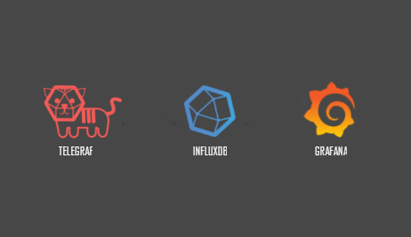

# Docker Compose project for Telegraf, InfluxDB and Grafana

<p align="center">
    
</p>

TIG is a combination of Telegraf, InfluxDB and Grafana . This is a deployment in docker.

## Pre requisites

- Make sure the latest docker version is installed.


## Start the stack with docker compose

```bash
$ docker-compose up
```

## Services and Ports

### Grafana
- URL: http://localhost:3000 
- User: admin 
- Password: admin 

### Telegraf
- Port: 8125 UDP (StatsD input)

### InfluxDB
- Port: 8086 (HTTP API)
- User: admin 
- Password: admin 
- Database: influx


Run the influx client:

```bash
$ docker-compose exec influxdb influx -execute 'SHOW DATABASES'
```

Run the influx interactive console:

```bash
$ docker-compose exec influxdb influx
```

If you want to [Import](https://docs.influxdata.com/influxdb/v1.8/tools/shell/#import-data-from-a-file-with-import) data from a file with -import:

```bash
$ docker-compose exec -w /imports influxdb influx -import -path=data.txt -precision=s
```

## Finishing touches
1. Ceate or [import](https://grafana.com/grafana/dashboards/) your own dashboards.
2. If your host is not a docker environment Install telegraf from [here](https://docs.influxdata.com/telegraf/v1.21/introduction/installation/).


## License